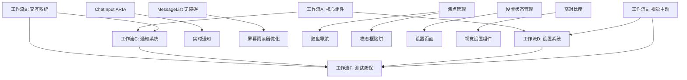

# DeepChat 无障碍访问并行执行计划

## 并行开发策略

基于任务依赖关系和技能需求，将无障碍功能开发分为多个并行工作流，最大化开发效率。

## 工作流分组

### 🏗️ 工作流 A: 核心组件无障碍改进
**专注领域**: UI组件ARIA标签、语义化结构  
**技能要求**: Vue.js, HTML语义化, ARIA标准  
**预计时长**: 2-3周  

**并行任务**:
```
A1: ChatInput.vue 无障碍改进      [3天] 
A2: SideBar.vue 导航优化         [2天]  
A3: ChatView.vue 主内容区        [2天]
A4: MessageList.vue 消息无障碍   [3天]
A5: 设置页面表单无障碍           [2天]
```

**推荐 Subagent**: `frontend-designer`
- 专门处理UI组件的无障碍设计和实现
- 分析现有组件的ARIA标签缺失
- 生成符合WCAG标准的组件实现

### 🎯 工作流 B: 交互系统开发
**专注领域**: 键盘导航、焦点管理、快捷键  
**技能要求**: 事件处理, 键盘交互, 用户体验  
**预计时长**: 2-3周  

**并行任务**:
```
B1: 焦点管理系统 (useFocusManagement.ts)      [4天]
B2: 键盘导航增强                             [5天] 
B3: 快捷键系统 (useKeyboardShortcuts.ts)     [3天]
B4: 跳过链接实现                             [2天]
B5: 模态框焦点陷阱                           [2天]
```

**推荐 Subagent**: `general-purpose`
- 实现复杂的键盘交互逻辑
- 处理焦点管理和快捷键系统
- 确保键盘导航的完整性

### 📢 工作流 C: 通知和状态系统
**专注领域**: 实时通知、屏幕阅读器优化、语音反馈  
**技能要求**: 辅助技术集成, 状态管理  
**预计时长**: 1-2周  

**并行任务**:
```
C1: 实时通知系统 (useA11yAnnouncement.ts)    [3天]
C2: 屏幕阅读器内容优化                       [4天]
C3: 状态更新语音反馈                         [2天]
C4: 错误和成功消息通知                       [2天]
```

**推荐 Subagent**: `general-purpose`
- 开发通知系统的核心逻辑
- 集成屏幕阅读器API
- 处理异步状态通知

### ⚙️ 工作流 D: 设置和配置系统
**专注领域**: 无障碍设置页面、状态管理、持久化  
**技能要求**: Pinia状态管理, 设置UI, 配置持久化  
**预计时长**: 2-3周  

**并行任务**:
```
D1: 无障碍设置状态管理 (accessibilityStore.ts) [3天]
D2: A11ySettings.vue 主设置页面               [4天] 
D3: 设置子组件开发                           [5天]
D4: 设置持久化和同步                         [2天]
D5: 设置页面集成                             [2天]
```

**推荐 Subagent**: `frontend-designer`
- 设计设置页面的UI布局
- 实现设置表单组件
- 确保设置页面本身的无障碍性

### 🎨 工作流 E: 视觉和主题系统
**专注领域**: 高对比度、字体缩放、视觉辅助  
**技能要求**: CSS主题, 响应式设计, 视觉设计  
**预计时长**: 1-2周  

**并行任务**:
```
E1: 高对比度主题开发                [4天]
E2: 字体缩放系统                   [3天] 
E3: 焦点指示器增强                 [2天]
E4: 颜色对比度检查工具             [2天]
E5: 减少动画功能                   [2天]
```

**推荐 Subagent**: `frontend-designer`
- 开发视觉辅助功能
- 创建高对比度主题
- 实现响应式字体缩放

### 🧪 工作流 F: 测试和质量保障
**专注领域**: 自动化测试、手动测试、文档  
**技能要求**: 测试框架, axe-core, 文档编写  
**预计时长**: 1-2周  

**并行任务**:
```
F1: 自动化无障碍测试框架            [3天]
F2: 组件单元测试                  [4天]
F3: 集成测试和E2E测试             [3天] 
F4: 手动测试和用户测试             [4天]
F5: 文档和使用指南                [2天]
```

**推荐 Subagent**: `general-purpose`
- 建立测试基础设施
- 编写全面的测试用例
- 生成测试报告和文档

## 依赖关系图



## 并行执行时间线

### 第1-2周: 基础建设阶段
```
并行执行:
┌─ 工作流 A ─┐  ┌─ 工作流 B ─┐  ┌─ 工作流 E ─┐
│ A1: ChatInput  │  │ B1: 焦点管理   │  │ E1: 高对比度  │
│ A2: SideBar    │  │ B4: 跳过链接   │  │ E3: 焦点指示器│  
│ A3: ChatView   │  │              │  │              │
└──────────────┘  └──────────────┘  └──────────────┘
```

### 第3-4周: 核心功能阶段  
```
并行执行:
┌─ 工作流 A ─┐  ┌─ 工作流 B ─┐  ┌─ 工作流 C ─┐  ┌─ 工作流 D ─┐
│ A4: MessageList│  │ B2: 键盘导航  │  │ C1: 通知系统  │  │ D1: 状态管理  │
│ A5: 设置表单   │  │ B3: 快捷键    │  │ C2: 屏幕阅读器│  │ D2: 设置页面  │
└──────────────┘  └──────────────┘  └──────────────┘  └──────────────┘
```

### 第5-6周: 高级功能阶段
```
并行执行:
┌─ 工作流 C ─┐  ┌─ 工作流 D ─┐  ┌─ 工作流 E ─┐
│ C3: 语音反馈  │  │ D3: 设置组件  │  │ E2: 字体缩放  │
│ C4: 消息通知  │  │ D4: 持久化    │  │ E4: 对比度检查│
└──────────────┘  └──────────────┘  └──────────────┘
```

### 第7-8周: 测试和优化阶段
```
并行执行:
┌─ 工作流 F ─┐  ┌─ 工作流 D ─┐  ┌─ 工作流 E ─┐
│ F1: 测试框架  │  │ D5: 设置集成  │  │ E5: 减少动画  │
│ F2: 单元测试  │  │              │  │              │
│ F3: 集成测试  │  │              │  │              │
└──────────────┘  └──────────────┘  └──────────────┘
```

### 第9-10周: 最终测试和发布
```
串行执行:
┌─ 工作流 F ─┐
│ F4: 手动测试    │
│ F5: 文档编写    │  
│ 最终集成测试    │
│ 发布准备       │
└──────────────┘
```

## Subagent 分配建议

### 🎨 frontend-designer 专项任务
**优势**: 视觉设计、组件架构、UI一致性  
**分配任务**:
- 工作流 A: 核心组件无障碍改进 (A1, A2, A3, A4)
- 工作流 D: 设置页面设计和实现 (D2, D3, D5) 
- 工作流 E: 视觉和主题系统 (E1, E2, E3, E4, E5)

**Prompt 示例**:
```
请使用 frontend-designer agent 来实现 ChatInput.vue 的无障碍改进。
需要分析当前组件的ARIA标签缺失，设计符合WCAG标准的改进方案，
并生成具体的实现代码。重点关注文件上传、发送按钮、拖拽区域的无障碍支持。
```

### 🔧 general-purpose 通用任务  
**优势**: 逻辑实现、系统集成、复杂功能  
**分配任务**:
- 工作流 B: 交互系统开发 (B1, B2, B3, B4, B5)
- 工作流 C: 通知和状态系统 (C1, C2, C3, C4)
- 工作流 F: 测试和质量保障 (F1, F2, F3, F4, F5)

**Prompt 示例**:
```
请使用 general-purpose agent 来实现焦点管理系统。
需要创建 useFocusManagement.ts 组合式函数，实现焦点陷阱、焦点恢复、
焦点指示器等功能。确保与现有的Vue组件系统兼容。
```

### 🏗️ code-refactorer 重构优化
**优势**: 代码优化、架构改进、性能提升  
**分配任务**:
- 现有组件的无障碍重构
- 代码结构优化和清理
- 性能优化和最佳实践应用

**Prompt 示例**:
```
请使用 code-refactorer agent 来重构 MessageList.vue 组件，
添加完整的ARIA支持和语义化结构，同时保持现有功能不变。
优化组件的可读性和维护性。
```

## 质量控制检查点

### 检查点 1: 基础组件完成 (第2周末)
- [ ] 主要组件ARIA标签完整
- [ ] 基础键盘导航可用
- [ ] 语义化结构正确
- [ ] 焦点管理基础功能

### 检查点 2: 核心功能完成 (第4周末)  
- [ ] 实时通知系统可用
- [ ] 屏幕阅读器基础支持
- [ ] 快捷键系统完整
- [ ] 设置页面基础功能

### 检查点 3: 高级功能完成 (第6周末)
- [ ] 视觉辅助功能完整
- [ ] 设置系统完全集成
- [ ] 认知辅助功能可用
- [ ] 多媒体无障碍支持

### 检查点 4: 测试完成 (第8周末)
- [ ] 自动化测试通过
- [ ] 手动测试完成
- [ ] 用户测试反馈
- [ ] 文档和指南完整

## 风险管理

### 高风险任务
1. **B1: 焦点管理系统** - 核心依赖，影响多个功能
2. **D1: 设置状态管理** - 架构基础，影响设置功能
3. **C1: 实时通知系统** - 屏幕阅读器核心功能

### 缓解策略
- 高风险任务优先开始，预留额外时间
- 建立任务间的备选方案和降级策略  
- 定期同步和集成测试
- 建立快速反馈和调整机制

这个并行执行计划确保了开发效率的最大化，同时维护了质量和功能完整性。通过合理的任务分配和subagent使用，可以在8-10周内完成完整的无障碍功能实现。